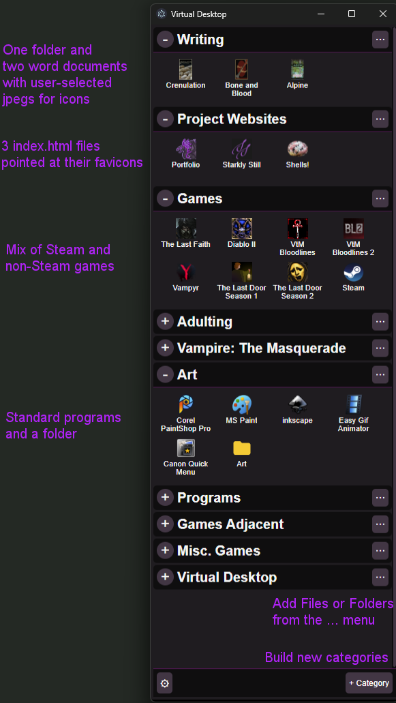

# Virtual Desktop
## What is it
A minimal electron app that allows you to create shortcuts via file navigation and then sort them into self-created categories.  This is designed for users with deeply nested folder structures that must remain nested.  This creates a virtual flat, structure like a standard desktop, but uses the category expansion panels to create an organized system.  Installs with run on startup.  The initial size and position on your desktop is configurable.

Available actions include...
- Categories
	- Add
	- Delete
	- Update settings
		- Rename
		- Default Open/Closed
		- Position (order from top to bottom)
	- Add File
	- Add Folder
- Shortcuts
	- Remove (delete)
	- Launch (on double click)
	- Reorder (by drag and drop with in a category)
	- Move (to another category)
	- Rename (sets an alias on top of the real file/folder name)
	- Modify Icon (has four modes)
		- Standard (current default)
		- Steam (current default for .url)
		- PDF (current default for .pdf)
		- Custom (point to any image file type)
- App
	- Configure startup location and size on desktop (via gear button)
		- x
		- y
		- height
		- width
	- Show file extensions

## Fresh Machine Installation Steps
### The usual
1. Run `npm install`
2. See `package.json` for commands

### Configure Windows Auto-Launch on Boot for Dev Work
To make the application automatically run when you log into Windows:
1. Press `Win + R` on your keyboard to open the Run window.
2. Type `shell:startup` and press `Enter` to open your user account's startup folder.
3. Copy the `virtual-desktop-launcher.bat` file from this project folder.
4. Paste it directly into that Windows Startup folder.
5. Update the path in the file to match the project's root.

### For Build
- `npm install`
- `npm run build`
- snag `Virtual Desktop Setup [Version Number].exe` from dist
- Run the installer and launch it
- On launch, it will auto register itself to run on startup

---